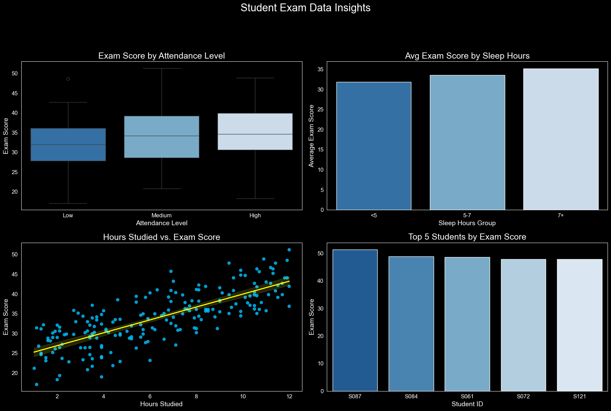

# 🎓 Student Exam Score Analysis

## 📊 Overview

This project is an Exploratory Data Analysis (EDA) of the `student_exam_scores.csv` dataset. The primary goal is to identify key factors that influence student performance and exam scores.

The entire analysis is consolidated into a single Python script that handles data cleaning, processing, and visualization. It culminates in a 2x2 dashboard displaying the top insights related to attendance, sleep, study hours, and top performers.

## 🎨 Visualization Style

This project uses a consistent and professional dark theme (`plt.style.use("dark_background")`) for all visualizations. The `Blues_r` color palette is used for sequential and comparison plots, ensuring a clean and readable aesthetic.

## 🛠️ Tools & Libraries Used

- **Python**
- **Pandas:** For data loading, cleaning, and manipulation.
- **NumPy:** For numerical operations.
- **Matplotlib:** For creating the main dashboard (subplot) structure.
- **Seaborn:** For advanced statistical visualizations.

## 🧽 Data Cleaning & Preparation

Before analysis, the data was thoroughly cleaned to ensure accuracy:

1.  **Type Conversion:** Columns were converted to their correct data types (e.g., `student_id` to `string`, numerical columns to `pd.to_numeric`).
2.  **Missing Values:** Checked all columns for `null` values. Any missing numerical data was filled using the **median** value of its column.
3.  **Duplicate Rows:** Ran `drop_duplicates()` to remove any duplicate entries from the dataset.

## 💡 Key Visual Insights

The analysis is presented in a 2x2 dashboard to provide a comprehensive overview of student performance drivers.

**(Note: The script generates the following dashboard. For your repository, run the script and save the output as `student_insights_dashboard.png`.)**

---

### 1\. Exam Score by Attendance Level

- **Analysis:** A Boxplot shows the distribution of exam scores based on binned attendance levels (Low, Medium, High).
- **Insight:** This visual clearly demonstrates the strong positive impact of higher attendance on exam scores, showing that students in the "High" attendance bracket consistently achieve better results.

### 2\. Average Exam Score by Sleep Hours

- **Analysis:** A Barplot compares the average exam score for different sleep groups (binned as \<5, 5-7, and 7+ hours).
- **Insight:** This chart highlights a clear correlation between adequate sleep and academic performance, with the "7+" hours group showing the highest average scores.

### 3\. Hours Studied vs. Exam Score

- **Analysis:** A Scatter Plot (with a regression line) maps the direct relationship between the number of hours studied and the final exam score.
- **Insight:** The upward-trending regression line confirms a strong, positive correlation: the more hours a student studies, the higher their score is likely to be.

### 4\. Top 5 Students by Exam Score

- **Analysis:** A simple Barplot identifying the top 5 individual performers by their `student_id`.
- **Insight:** This chart provides a quick look at the highest-achieving students in this dataset.

